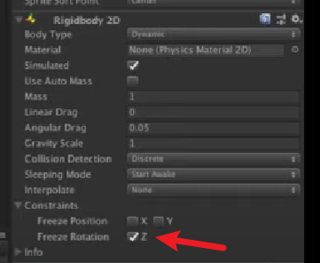
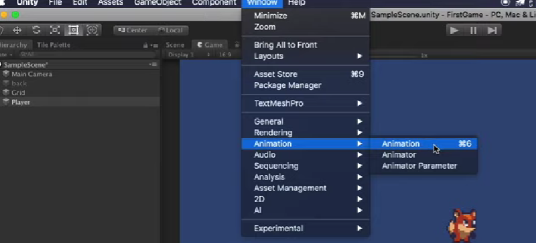
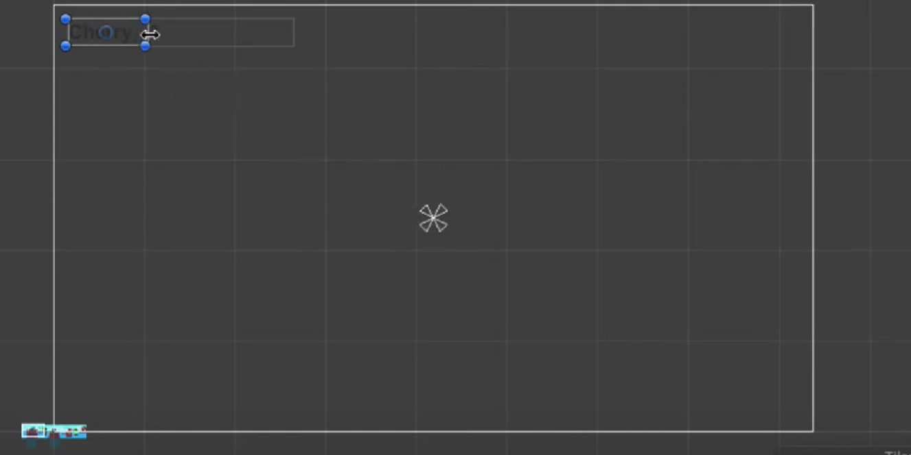
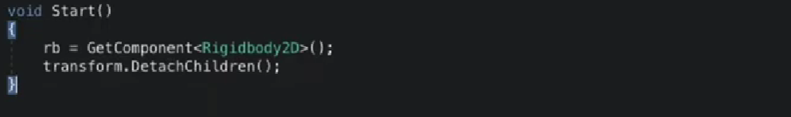
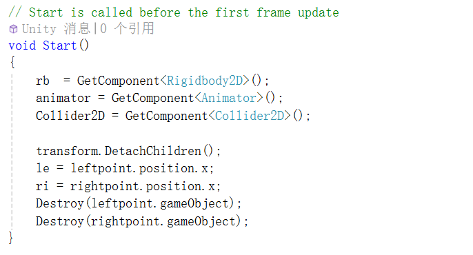
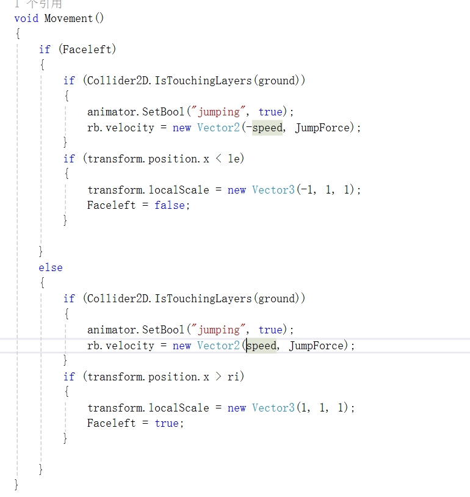
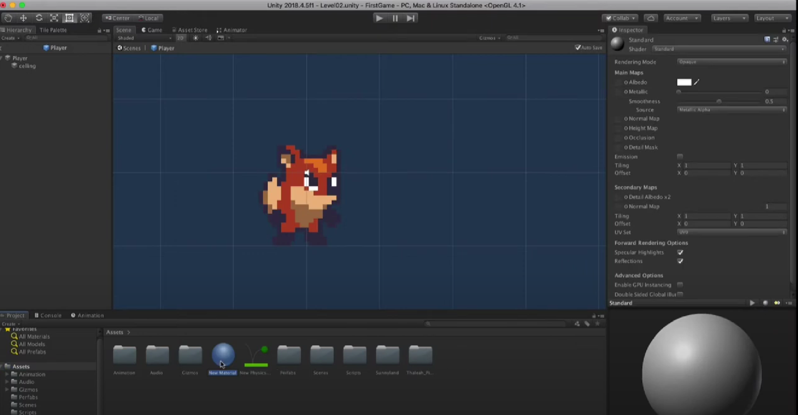
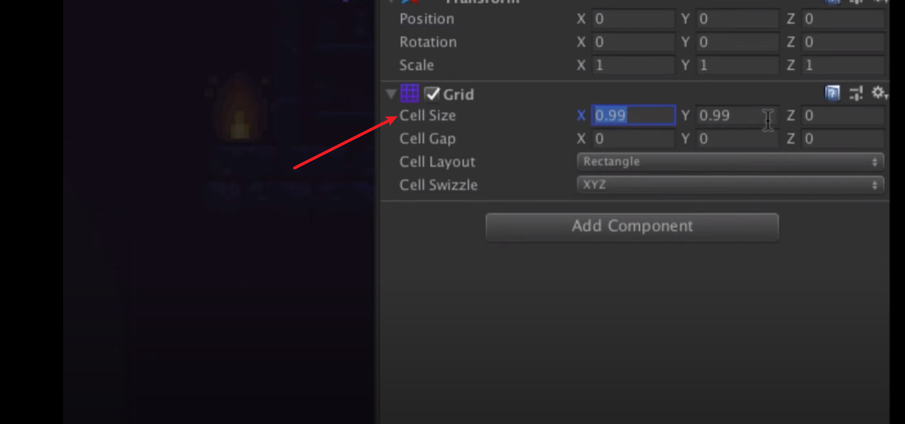
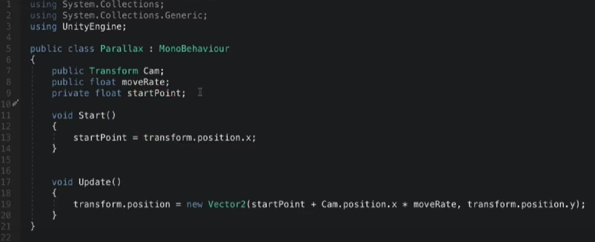

# Unity教程-2D小狐狸-个人笔记

## 00 说在前面

- 此文档根据教程[Unity2018教程 Your First Game 2D小狐狸游戏制作](https://www.youtube.com/watch?v=1VekzyeSmtA&list=PL_Pb2I110MfGAsoqtDs8-6kEU55wU8CnE&index=1)学习制作而成，主要为笔者对应每个视频的个人笔记，方便后续复习使用

## 01 安装与入门

- 学习unity安装以及素材的导入
- Asset Store可以购买素材（现在在笔者使用的2022.3版本的unity中已经剥离出unity成为独立的网页 可以在unity里面跳转）

## 02 素材处理

- 导入素材的时候需要调整Pixels per unite从100到16  这样不会使得背景显示出来每个unit的像素十分密集而过于窄小
- 编辑素材（切割素材）使用Hierarchy中create Tilemap；在Tilemap拖拽导入想要切割的素材图片 使用Sprite editor按钮 展开后点击左上角和Slice键 完成自动切割
- 我们可以自己定义切割的像素（根据一个unit多少个像素自己调整）以及切割的方法（按照单个单元格绘制）
- Tile palette为进行素材填充时候的画板与颜料（选择 移动 笔刷等）

## 03 角色、组件与图层

### 图层概念

如何实现图层排序？

方法一：点击sorting layer  进行添加图层选择 添加你所需要的图层数，越在下面的图层越靠前

方法二：设置同一图层 选择order排序 数字越大 越显示在前面

### 添加fox

方法一：直接拖入 并且设置像素unit比 然后设置正确的图层

方法二（常用）：在hierarchy中添加一个新的Sprite 在Sprite中添加Component   利用Sprite Render尝试将图层渲染到画面里成为一个项目

### 理解常用组件

当我们添加完fox以后 fox本身没有任何的重力 碰撞等 我们需要依赖组件进行实现

#### RigidBody 2D（2D刚体）


这个组件可以用来设定重力 使得fox进行自由落体

但是仅仅使用这个组件 fox并没有掉落在我们设定的地面上 这是因为没有添加碰撞体

#### Collider


对于所有collider而言 绿色框为碰撞有效框

我们可以为fox添加Box类型的Collider

同样 我们需要为地图添加 地图为Tilemap  我们有Tilemap对应的碰撞器

## 04 角色移动

#### 对应

在input manger管理用户输入与运动物体的对应


#### 控制角色

使用C#脚本进行控制 我们需要创建C#脚本  类似的脚本也是一种组件 （如下）


为了后续方便管理脚本 我们把脚本放在Assets下面的我们自创的一个文件夹即可

---

接下来需要连接刚体到脚本中的属性


然后 发现狐狸在不停的旋转 我们选择刚体进行操作 使其不在z轴旋转



（注意 当你要进行添加脚本或者组件以后 一定要保存ctrl +s 并且修改之前关闭游戏模式

或者在游戏模式中进行修改 然后关闭游戏模式之前保存你目前的设置）

## 05 角色转向和跳跃

### 转向的本质

转向其实就是改变scale的x值（-1朝左 +1朝右）


### 跳跃的本质

跳跃是通过获取用户输入，改变fox的位置

**复现遇到的bug**

bug1：在进行跳跃设置的时候发现跳跃卡顿 而且发现有无法进行跳跃的情况 判断为刚体问题 修正刚体边框后解决

bug2:  过了一会儿出现相同的问题 原来的脚本如下：

```c#
using System.Collections;
using System.Collections.Generic;
using UnityEngine;

public class Fox : MonoBehaviour
{
    public Rigidbody2D rb;

    public float speed;

    public float jumpforce;

    // Start is called before the first frame update
    void Start()
    {
        
    }

    // Update is called once per frame
    void FixedUpdate() // 由于有些电脑无法达到60帧/s 使用FixedUpdata函数使更平滑
    {
        Movement();
    }

    void Movement()
    {
        float horizontalmove;
        horizontalmove = Input.GetAxis("Horizontal"); // 这里其实就是我们一开始看的玩家输入  -1  0  1 
        float facedirection = Input.GetAxisRaw("Horizontal");


        if (horizontalmove != 0)
        {
            rb.velocity = new Vector2(horizontalmove*speed*Time.deltaTime, rb.velocity.y);
        }

        if (facedirection != 0)
        {
            transform.localScale = new Vector3(facedirection * 1, 1, 1);
        }

        if (Input.GetButtonDown("Jump"))
        {
            rb.velocity = new Vector2(rb.velocity.x, jumpforce);
        }
    }

}

```

更改过后的脚本如下

```c#
using UnityEngine;

public class Fox : MonoBehaviour
{
    public Rigidbody2D rb;
    public float speed;
    public float jumpForce;

    public bool isJump = false;


    // Start is called before the first frame update
    void Start()
    {

    }
    private void Update()
    {
        if (Input.GetButtonDown("Jump"))
        {
            isJump = true;

        }
    }

    // Update is called once per frame
    void FixedUpdate()
    {

        Move();
        Jump();
    }

    void Move()
    {
        float horizontalmove = Input.GetAxisRaw("Horizontal");
        rb.velocity = new Vector2(horizontalmove * speed * Time.fixedDeltaTime, rb.velocity.y);

        if (horizontalmove != 0)
        {
            transform.localScale = new Vector3(horizontalmove, 1, 1);
        }
    }

    void Jump()
    {
        if (isJump)
        {
            rb.velocity = new Vector2(rb.velocity.x, jumpForce * Time.fixedDeltaTime);
            isJump = false;
        }

    }


}
```

主要实现了将Jump剥离出来 然后放入Updata方法进行判断是否jump

另外 如果跳不起来一定要看下jump的力有没有设置

## 06 动画效果

### 如何添加动画

1. 加入下面的插件


2. 创建一个新的Controller放入对应的Component里面


3. 选择window里面的Animation



4. 选择Player创建idle 拿出我们准备好的素材拖入


5. 调整sample或者拖动时间轴

### 跑动与走路转换

实现方法有很多种，根据教程，使用了一个速度的判定


## 07 跳跃效果

### 图层的概念

跳跃效果也要添加脚本，这里不过多解释，我们主要是可以在这里学习到图层的概念并且在脚本中使用图层


## 08 方形碰撞器

### 碰撞体的作用

碰撞器是为了模拟真实场景而提出的，碰撞器想要生效必须加刚体


同时，由于只用方形碰撞器可能不太丝滑，所以代码不需要更改 ，我们将跟地面碰撞的碰撞器改为圆形

### unity 两物体碰撞问题

unity创建3d对象时自带碰撞体 

触发 OnTriggerEnter需要条件
两者任意一方带刚体，两者都有碰撞体，且两者必须有一个勾选is Trigger

触发OnCollisionEnter需要条件
两者任意一方带刚体，两者都有碰撞体，且两者都不勾选is Trigger；（游戏中，最好运动的物体带刚体，静物只带碰撞体就行了）

### 文档介绍

在中文文档中 我们可以搜索我们想要知道的东西 并且留意我们的unity版本

[Unity User Manual 2022.3 (LTS) - Unity 手册](https://docs.unity3d.com/cn/2022.3/Manual/index.html)

## 09 镜头跟随

### 简单方法

简单来说 可以让镜头的x y跟fox一样


在main camera添加script组件


默认z是-10

### 使用package-Cinema chine


额外添加组件Confiner 帮助找到位置 来确定在哪一个范围内可以移动镜头


## 10 物品收集和场景

### 添加步骤

1. 类似于人物的添加 我们加入樱桃 不要忘记调整樱桃到最前面的图层

2. 同时依次为樱桃添加   Animator /   Animator Controller /  动画效果等

3. 之后我们要为樱桃添加Collider

4. 同时为了使道具生效  我们需要勾上is Trigger的选项

5. 然后在Player Controller里面写脚本  使得角色触碰到物品的时候物品对应的值加一

6. 为cherry和其他物品添加collection的标签

   

### Perfabs使用

当我们对于某个物体有了一定的设定之后 我们同样需要在其他地方 或者另一个关卡进行使用

我们可以在Script下面新建一个文件夹 Perfabs 进行处理  并将左侧我们设定好的东西拖拽进入我们新建的文件夹保存好 

后面再用到相应的素材的时候 可以直接使用

同时，当我们更改Perfabs中的素材的时候  所有使用到该地方素材的复制体都会相应的进行属性修改

### 场景美化

为了方便我们进行处理    我们可以创建更多的图层  比如添加environment图层

调整图层的顺序   进行图层的显示


## 11 物理材质和处理空中跳跃

### 物理材质

因为是真实的模拟 所以在两个Collider碰撞的时候 会产生摩擦力

所以我们要更改物体的材质


**bug：unity 2d角色移动时卡住原地踏步的原因**
可能是碰撞盒子是正方形 被地图的碰撞体卡住的原因
应该把脚底做成圆形的碰撞盒 防止和地面的碰撞盒子卡住

### 空中跳跃

加一行接触的限制就可以，同样是在脚本里修改

## 12 UI入门

### 基本设置

1. 所有的UI必须在Canvas（画布）里面（比如下面在canvas里面添加两个text，然后修改名字）

   

   调整粗体 居中等字体状态


### UI对应数量增加


### 定位布局排版

下图中心符号的含义为，左上角这个框永远以中心的这个点为中心 保持这样的一个位置关系



因此我们需要调整视图   使得文本框一直定位在左上角


## 13 敌人添加

### 创建基础

类似于添加角色，将初始化的idle场景拖入sprite

### 添加组件

1.重力 2. 碰撞体

### 实现和敌人的脚本交互

这里简单的实现了如果falling状态遇见敌人就销毁的逻辑


## 14 角色受伤

### 脚本添加hurt变量

增加脚本中hurt对于角色行动的控制

### 增加hurt场景到角色

类似的增加    我们主要需要考虑从哪些情况能跳转到hurt场景

## 15 敌人AI

### 循环机制

#### 设定子标记点

这里left和right会同时继承frog所有的属性


#### 添加新脚本


#### 解决办法

1. 游戏开始的时候  断绝父子关系   但是如果有两个以上的青蛙会出问题   因为断绝关系以后的objct全部回到根下面

   

2. 游戏开始的时候  获取left和right的x和y值  然后将其直接销毁

   

**bug**：这里由于自己左右不分打错了  导致一直在左边反弹（）

## 16 Animation Events

### 处理自然下落击杀敌人


### 添加自动动画转换

类似的创建文件夹和影像，拖入frog


### 设置脚本






### 解决无法回到idle问题

我们希望在idle动画结束之后再进行跳跃

那么我们就把movement函数加载到idle最后项的后面


不要忘了删除movement


## 17 Class调用（重要）

### 老鹰制作

bug：动画没有播放 这里是没有勾选loop time的标签导致的


### 添加老鹰死亡

Death效果

### 在一个类中调用另一个类

eg：我在fox里面是没办法访问frog和eagle里面的效果的 但我可以创建一个对应的实例


之后，为eagle添加摧毁代码


删掉原来fox的Destory代码


此时，我们可以把摧毁代码写在fox里面，然后进行不同对象的摧毁


然后 在相应的敌人类里面 安排先触发动画然后再死亡的顺序


之后 爆炸结束的瞬间 添加death


### 在多个enemies应用的效果

难道我在每一个类中都要添加吗？

我又如何判断我撞击的是谁呢？

#### 利用父类实现

1. 新建类Enemy

   注意protected和virtual

   

2. 让frog和eagle都是它的子类

   

3. 删除重新调用的组件（如果有）


4. 固定写法获得父component，重新编辑start

   注意重写 和base

   

5. 设置统一调用

   注意public

   

6. 更改eg中的写法（如果需要）


## 18 添加音效


###  Audio Listener

听声音的

### Audio Source

播放器（音源）

#### 直接使用插件

比如对player使用插件进行游戏音效的添加


#### 使用插件和脚本

如果想要在特定情况下（比如敌人死亡才触发音乐）  我们同样使用Audio Source进行音乐的导入 比方说我们有下面的这些音频


**tips：当我们想更改prefebs 我们点击箭头进入预制体的修改**


我们添加完组件和对应的音乐以后，需要在脚本里进行修改

cit：我个人感觉这里添加到哪个地方比较关键的，可能添加的地方不对的话音效就不会触发，因此尽量避开销毁

这个地方一定要留意

**bug：unity3d中避免游戏物体绑定的音频在物体被销毁时无法播放**

https://blog.csdn.net/HappySkeleton/article/details/116216088

### Audio Clips

具体播放的声音

## 19 对话框

个人理解是：不同游戏的处理不同  个人经验而言 一些游戏可以添加**fungus**等组件  这样可以加速开发 但是效果要另说

### 使用panel

视频教程中使用了在画板中添加panel的方式  并为panel上添加text  调整其字体和大小


### 如何显现出对话框

我们还是在门上添加触发器

方法：在house上添加box collider2D  然后添加一个脚本到house上


同时 不要忘记离开的时候也要添加


### 动画的渐入效果  

这里需要新建一个动画


利用 关键帧  调整对比度 进行动画制作（点最左边那个红点）


## 20 趴下效果

### 两种对应


### 制作按键

这里主要是记得这里有个自定义


### 添加下蹲

思路还是一样 这里可以再考虑一遍

1. 首先进行下蹲的animation的添加  点击场景中的角色为其添加animation

2. 然后拖入动画 调整动画的pixel per unit 使其符合场景  调整播出参数

3. 设置player的animator  在里面添加刚刚的‘下蹲’ 以及和idle的转换链接
4. 在左侧添加参数   而后为刚刚的两个转换链接添加参数判断  并修改转换链接的效果
5. 更改脚本 （我们可以新添加一个函数）
6. 处理碰撞器


### 如何处理碰撞

这里我们如果要看它的碰撞体  可以点击这里


这样在游戏中我们也可以看到碰撞体了


此时 我们的下蹲就可以这样：下蹲时让上半部分的collider消失  同时如果上方有图层（ground layer） 不能起立 

那么 如何判断角色上方有图层？


我们可以看到角色的celling是可以更改的 另外 这也是可以获取的一个transform（相让碰撞体禁止使用就将它的值设定为false）


## 21 场景控制

UnityEngine里面的SceneMangement库


这个库用于加载场景相关  同时在教程中 这为角色重新死亡后的复活提供了方法

### 死亡复活

比如我们添加一条死亡线


### 转换场景

根据库 转换场景有两个方式

一个是用场景的名字 一个是用场景的编号（我个人感觉不要用场景的编号 直接用名字） 


## 22 2D光效

在教程中实现的时候没用任何代码   主要是用package

### 理解光照和材质

换成散射光的材质


添加light（如果主角没添加接受散射光的材质就不会有变化）


windows -》 package manger

### 创建材质

我们可以自行创建material



然后把material变成diffuse


调整grid size让它渲染的更细节一些



project setting里面也有更多的设定


### 如何打光

1.跟随fox视角的光（把光变成组件，很简单）     

2.固定在某个位置的光

**tips：在2D游戏，我们可以根据z值进行光源的缩放，虽然场景是2D的，但是我们的光依然是3D的**


## 23 优化代码

### Animator条件瘦身

默认idle  不改也行

### 移动跳跃手感调整

这个就是把jump和下蹲设置成两个额外的方法

### 敌人碰撞器反复触发

death的时候碰撞体失效就可以防止爆炸结果移动


### 樱桃多次计数bug

移动速度过快的时候，可能会出现这个bug

解决方法：加一个动画到最后，在动画结束再进行结算

主要有一个要解决的问题是，如何在一个新的类里面让cherry的count + 1

视频中给出的方法是添加public方法


然后在最后调用event


同时不要忘记添加animation的调用


**Tips：这里给了一个比较方便的debug的方法 利用SerializeField(序列化)关键字让属性在inspector里面变得可见**


这样做以后发现text到具体的数字展示是有延迟的，因此我们把text转成数字的代码放入update里面


那么为什么onCollider和onTrigger不用放到update里面呢？

这牵涉到生命周期的问题

## 24 视觉差

### 为什么需要视觉差

让三者以不同速度移动，增强视觉效果


### 实现思路

1. 首先讲background需要针对cinema chine 使用的collider转成一个物体的collider并重新设置

2. 使用脚本添加Camera的Transform  并且在start之后获得当前坐标的x值

3. 在Update中设置transform.position为相机x值的偏移（并且根据你最后的图层调整你的move rate）

   

4. 然后将此脚本拖拽到父级background上（这样子做 子集的背景都会受到脚本的影响了）

   

5. 同样 Y 也做相同的操作（可以加一个bool值用于确定某个BG是否移动）

## 25 主菜单

这里学会场景制作和跳跃即可 

## 26 暂停菜单

这里同样学会场景制作和跳跃即可 

## 27 手机控制

button是可以直接使用的 手机迁移的时候不需要做额外的处理

手机控制这里主要分为两部分

### 添加package

joystick

### 设置脚本

在fox中添加joystick（因为控制的是fox）

左右行走


跳跃和下蹲


其他还有一些需要更改的参数比如行走的时候停不下来（手机的误差是很大的）

但总之记住，所有的按钮都是button 我们需要button并在上面添加相应的函数代码 使其运行相应的功能

## 28 二段跳| 单向平台

如何让跳跃效果更好

### 主要实现

主要实现利用脚本  

首先加入groundcheck（判断脚底是否接触ground）


然后加入一个新的extraJump值


可以通过alt+↑或者↓去调整代码的行顺序


最后如果两段跳都跳完了可以给个一段的缓冲


### 单向平台

实际上的实现就是新建tilemap并且添加组件


扇形区域为可以踩的区域


## 29 音效管理（重要）

### 为什么需要音效管理

Player身上东西太多了 实在是比较累赘

### 实现方法

这里必须要提及的一个思想是静态类方法创建一个类的实例，然后使用实例调用里面的方法 请记住这种写法


### 建立流程

1. create object
2. 创建脚本 加到object上
3. 为组件添加audio source
4. 写脚本，创建一系列的变量（AudioClip）这些都是不同类型的声音
5. （我们写脚本的逻辑是不同的场景切换source的clip为对应的AudioClip）


## 30 打包游戏

### Project Setting

进入之后

选择不同平台以及不同的运行版本

x86   32bit

x86-64     64bit

### Player Setting

这里可以设定游戏的名称  版本 以及游戏的图标

选择启动是否全屏或者后台

并选择是否添加相应的Splash Image


这个地方是处理游戏质量的


---

最后，非常感谢麦扣老师优质的入门教程！

本文档到此结束 ：）
